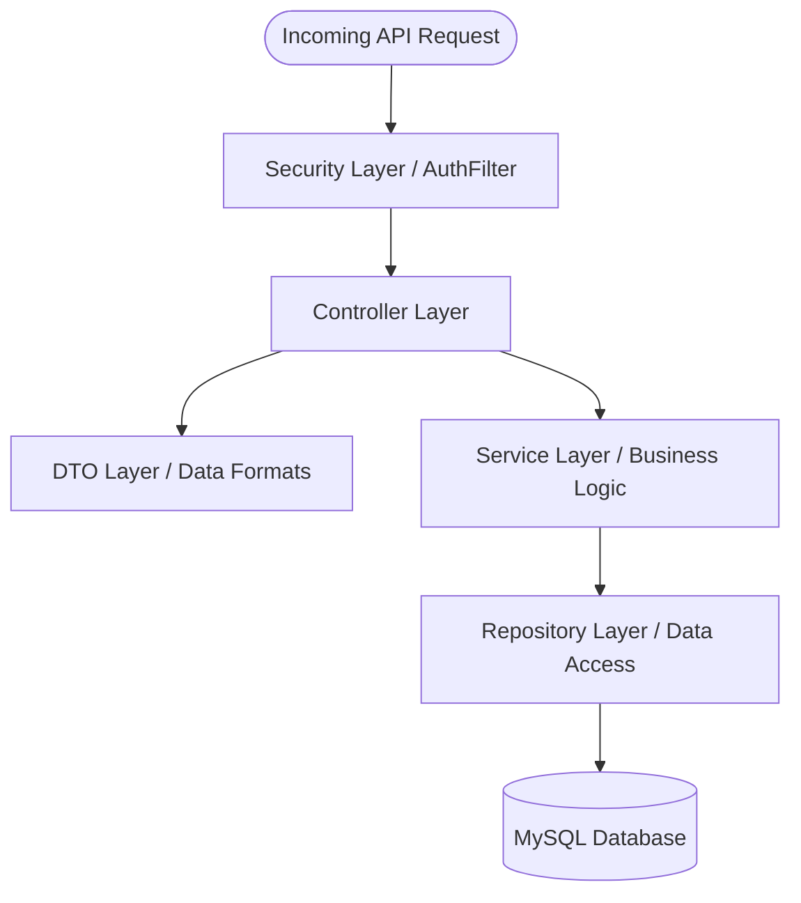
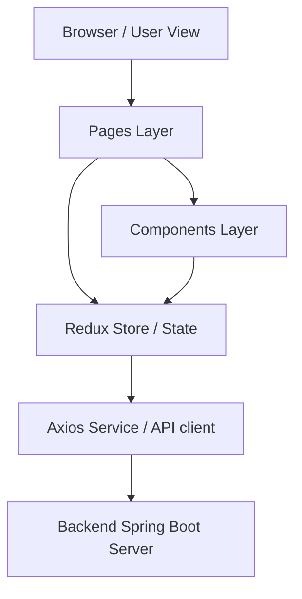

# System Architecture Guide: Fashionify 🏗️

This guide breaks down the directory layout and folder architecture of **Fashionify**, explaining the role and responsibility of each layer in plain, beginner-friendly English.

---

## 1. High-Level Directory Map

At the root of the project, you will find two primary directories:
- **`backend/`**: Built with Java and Spring Boot. Contains the business logic, security configuration, and database connection.
- **`frontend/`**: Built with React, Vite, and Redux. Contains the user interface and page designs.

Let's explore each directory in depth.

---

## 2. Backend Architecture (Spring Boot)

The backend code is located under `backend/src/main/java/com/fashionify/backend`. It is structured using a **Layered Architecture**. Each layer has a specific job and only talks to the layers directly adjacent to it.

Here is the breakdown of each backend package:

---

### 📂 `controller/` (Controller Layer)
*   **What is it?** The API entry points (endpoints) that define the URLs the frontend can talk to.
*   **Why do we need it?** Without controllers, the application cannot receive web requests from browsers. It acts as the "receptionist" for our server.
*   **How does it work here?** Controllers are annotated with `@RestController` and `@RequestMapping`. They receive HTTP requests (like `GET`, `POST`, `PUT`, `DELETE`), validate input parameters, and return JSON responses.
    *   *Key Files*: 
        *   [AuthController.java](file:///Users/subhajit/Developer/Development/fashionify/backend/src/main/java/com/fashionify/backend/controller/AuthController.java) (User sign-in and sign-up)
        *   [ShopProductController.java](file:///Users/subhajit/Developer/Development/fashionify/backend/src/main/java/com/fashionify/backend/controller/shop/ShopProductController.java) (Retrieving catalog items for customers)
        *   [AdminProductController.java](file:///Users/subhajit/Developer/Development/fashionify/backend/src/main/java/com/fashionify/backend/controller/admin/AdminProductController.java) (Product management for admins)
*   **What breaks if it is removed?** The frontend won't be able to communicate with the backend anymore. Entering any server URL will result in a `404 Not Found` error.
*   **How does it connect?** It receives requests from the **Frontend**, converts request payloads using **DTOs**, and forwards the business operations to the **Service Layer**.

---

### 📂 `service/` (Service Layer)
*   **What is it?** The home of all core business rules and calculations.
*   **Why do we need it?** Controllers should only handle network logic, and repositories should only handle database queries. The service layer keeps these two independent by holding the actual "rules of the business" (e.g. validating password strength, checking if inventory is sufficient, verifying email codes).
*   **How does it work here?** Classes are annotated with `@Service`. They write the logical algorithms and orchestrate calls to database repositories.
    *   *Key Files*:
        *   [OtpService.java](file:///Users/subhajit/Developer/Development/fashionify/backend/src/main/java/com/fashionify/backend/service/OtpService.java) (Generates and validates verification PINs)
        *   [CloudinaryService.java](file:///Users/subhajit/Developer/Development/fashionify/backend/src/main/java/com/fashionify/backend/service/CloudinaryService.java) (Uploads pictures to the cloud)
        *   [EmailService.java](file:///Users/subhajit/Developer/Development/fashionify/backend/src/main/java/com/fashionify/backend/service/EmailService.java) (Formats and fires registration emails via Brevo)
*   **What breaks if it is removed?** The application will have no business logic. There will be no rules to compute coupon discounts, process order statuses, or verify user logins.
*   **How does it connect?** It receives instructions from **Controllers**, interacts with external APIs, and queries database tables via **Repositories**.

---

### 📂 `repository/` (Repository Layer)
*   **What is it?** The interface that executes queries against the MySQL database.
*   **Why do we need it?** Writing raw SQL queries inside our business logic is error-prone and hard to maintain. Repositories abstract this by acting as a high-level API for database operations.
*   **How does it work here?** They extend `JpaRepository<Entity, ID>`. Spring Boot automatically generates standard database queries (like insert, update, select, delete) without us having to write SQL.
    *   *Key Files*:
        *   `UserRepository.java` (Queries users by email)
        *   `ProductRepository.java` (Queries products and handles sorting/filtering)
*   **What breaks if it is removed?** The backend cannot read or save any data. It will not be able to retrieve products, save orders, or register users.
*   **How does it connect?** It is called by **Services** and converts MySQL database rows into Java **Entities**.

---

### 📂 `entity/` (Entity Layer)
*   **What is it?** Java classes that represent the blueprints of our MySQL database tables.
*   **Why do we need it?** Since MySQL stores data in tables and Java operates on objects, we need a way to map database tables directly to Java classes (Object-Relational Mapping, or ORM).
*   **How does it work here?** Classes are annotated with `@Entity` and `@Table`. Every field in the class represents a column in the database.
    *   *Key Files*:
        *   [Product.java](file:///Users/subhajit/Developer/Development/fashionify/backend/src/main/java/com/fashionify/backend/entity/Product.java) (Represents the `products` table)
        *   [User.java](file:///Users/subhajit/Developer/Development/fashionify/backend/src/main/java/com/fashionify/backend/entity/User.java) (Represents the `users` table)
*   **What breaks if it is removed?** The application won't start because Hibernate/JPA won't know what tables to connect to or create.
*   **How does it connect?** Mapped by **Repositories** and used by **Services** to process data.

---

### 📂 `dto/` (Data Transfer Objects / DTOs)
*   **What is it?** Plain classes that define the format of the data sent back and forth between the frontend and the backend.
*   **Why do we need it?** Database entities contain sensitive data (like encrypted passwords) or complex relational structures. DTOs allow us to expose only the exact fields the frontend needs, keeping our data exchanges lightweight and secure.
*   **How does it work here?** Controllers receive request payloads as DTOs (e.g. `LoginRequest`) and return response payloads as DTOs (e.g. `ProductResponse`).
    *   *Key Files*:
        *   `LoginRequest.java` (Holds email and password inputs)
        *   `ProductDto.java` (Sanitized product details sent to client)
*   **What breaks if it is removed?** The app would have to send raw database entities to the frontend, risking security breaches (leaking credentials) and increasing payload sizes.
*   **How does it connect?** Serves as the payload container used by **Controllers** and **Services**.

---

### 📂 `security/` (Security Layer)
*   **What is it?** The gatekeeper that secures endpoints, inspects login status, and handles JWT tokens.
*   **Why do we need it?** To prevent unauthorized users from viewing admin pages, deleting products, or accessing other people's orders.
*   **How does it work here?** Extends Spring Security configurations. It intercepts every request using a custom filter to check for valid tokens.
    *   *Key Files*:
        *   [AuthTokenFilter.java](file:///Users/subhajit/Developer/Development/fashionify/backend/src/main/java/com/fashionify/backend/security/AuthTokenFilter.java) (Extracts and validates JWTs from cookies)
        *   [JwtUtils.java](file:///Users/subhajit/Developer/Development/fashionify/backend/src/main/java/com/fashionify/backend/security/JwtUtils.java) (Generates, reads, and signs JWT tokens)
*   **What breaks if it is removed?** The application would become completely insecure. Anyone could access admin panels or modify user accounts.
*   **How does it connect?** Intercepts requests *before* they reach **Controllers**.

---

### 📂 `config/` (Configurations)
*   **What is it?** Global settings classes that customize how Spring Boot works.
*   **Why do we need it?** To set up behaviors like allowing CORS, enabling caching, or setting up external client beans.
*   **How does it work here?** Annotated with `@Configuration` to register global setup options.
*   **What breaks if it is removed?** Features like the Redis/JVM Cache won't work, and the frontend will get blocked by the browser due to CORS errors.

---

## 3. Frontend Architecture (React)

The frontend is located inside the `frontend/src` directory. It uses **React (Vite)** for rendering and **Redux Toolkit** for application-wide state management.

Here is the breakdown of each frontend directory:

---

### 📂 `pages/` (Pages Layer)
*   **What is it?** The main screen layouts of the application.
*   **Why do we need it?** Websites have multiple screens (Home, Shop, Cart, Dashboard). Pages organize the layouts for each of these views.
*   **How does it work here?** Files inside represent complete views, structured into folders like `admin-view` and `shopping-view`.
    *   *Key Files*:
        *   `shopping-view/home.jsx` (Home view with hero banners)
        *   `admin-view/dashboard.jsx` (Admin metrics visualizer)
*   **What breaks if it is removed?** The user will see a blank page because there will be no screens to route to.
*   **How does it connect?** Configured in the **Routing** manager, importing child **Components** to build the layout.

---

### 📂 `components/` (Components Layer)
*   **What is it?** Reusable visual building blocks (like buttons, cards, headers, form fields).
*   **Why do we need it?** To avoid repeating HTML/CSS code across multiple pages. (e.g. we write the Product Card code once and render it on both the Search page and Home page).
*   **How does it work here?** Organized into sub-folders representing different scopes (e.g., `admin-view`, `shopping-view`, `ui` for base components).
*   **What breaks if it is removed?** The pages will be blank or disorganized because they won't have any visual elements to display.
*   **How does it connect?** Used by **Pages** to render interactive sections of the screen.

---

### 📂 `store/` (State Management)
*   **What is it?** A centralized, application-wide data store powered by Redux Toolkit.
*   **Why do we need it?** If the customer adds an item to the cart in the `Shop` page, the `Header` component needs to know immediately to update the cart count. Redux provides a single source of truth that all components can read from instantly.
*   **How does it work here?** Uses slices containing state variables and async thunks (API dispatchers).
    *   *Key Files*:
        *   [store.js](file:///Users/subhajit/Developer/Development/fashionify/frontend/src/store/store.js) (Registers all state slices)
        *   `auth-slice/index.js` (Manages login, token validations, and registration states)
*   **What breaks if it is removed?** State sharing will fail. Components will have to pass variables manually down through many levels of files, leading to bugs and unmaintainable code (prop-drilling).
*   **How does it connect?** Accessed by **Pages** and **Components** using `useSelector` and updated via `useDispatch`.

---

### 📂 `services/` (API client)
*   **What is it?** The network connector that sends requests to the backend server.
*   **Why do we need it?** To keep backend URLs, timeout rules, and header credentials configurations in a single place instead of scattered across React files.
*   **How does it work here?** Built using **Axios**. Sets up base URLs and enables credentials support to send JWT cookies automatically.
*   **What breaks if it is removed?** The frontend will fail to fetch backend data because it won't have a configured client to send network requests.
*   **How does it connect?** Triggered inside Redux **Store** thunks to fetch backend records.

---

### 📂 `context/` & `hooks/`
*   **What is it?** Custom React states and functions shared using standard React hooks.
*   **How does it work here?** Houses providers like the custom `theme-provider.jsx` for toggling dark/light views.

---

## 4. Frontend Routing (Navigation)

Routing is managed in [App.jsx](file:///Users/subhajit/Developer/Development/fashionify/frontend/src/App.jsx) using **React Router Dom**:
*   **Route Guards**: We use helper components (like `CheckAuth`) to inspect the user's role and logged-in status.
    *   If a non-logged-in user tries to open `/admin/dashboard`, the router automatically redirects them to `/auth/login`.
    *   If a regular customer tries to open `/admin/dashboard`, they get redirected to a `/unauth-page` (Unauthorized Page).

---

### 🔗 Next Steps & Documentation
* 🛍️ **[Project Overview](file:///Users/subhajit/Developer/Development/fashionify/docs/PROJECT_OVERVIEW.md)**: Conceptual guide to the store's goals, user roles, and features.
* ⚙️ **[Feature Flows Guide](file:///Users/subhajit/Developer/Development/fashionify/docs/FEATURE_FLOWS.md)**: Learn how user clicks process into database updates.
* 🔌 **[REST API Reference Guide](file:///Users/subhajit/Developer/Development/fashionify/docs/API_GUIDE.md)**: Explore routes, request formats, and permissions.
* 🗄️ **[Database Entity Guide](file:///Users/subhajit/Developer/Development/fashionify/docs/DATABASE_GUIDE.md)**: Study tables, relationships, and queries.
* 🎓 **[Beginner Onboarding Guide](file:///Users/subhajit/Developer/Development/fashionify/docs/BEGINNER_GUIDE.md)**: Learn the core concepts of the project from scratch.
* 🤝 **[Contributing Guide](file:///Users/subhajit/Developer/Development/fashionify/docs/CONTRIBUTING_GUIDE.md)**: Guidelines for styling, naming conventions, and contributing.
* 🔒 **[Publication Safety Audit](file:///Users/subhajit/Developer/Development/fashionify/docs/PUBLICATION_SAFETY_AUDIT.md)**: Verification of security patterns.
