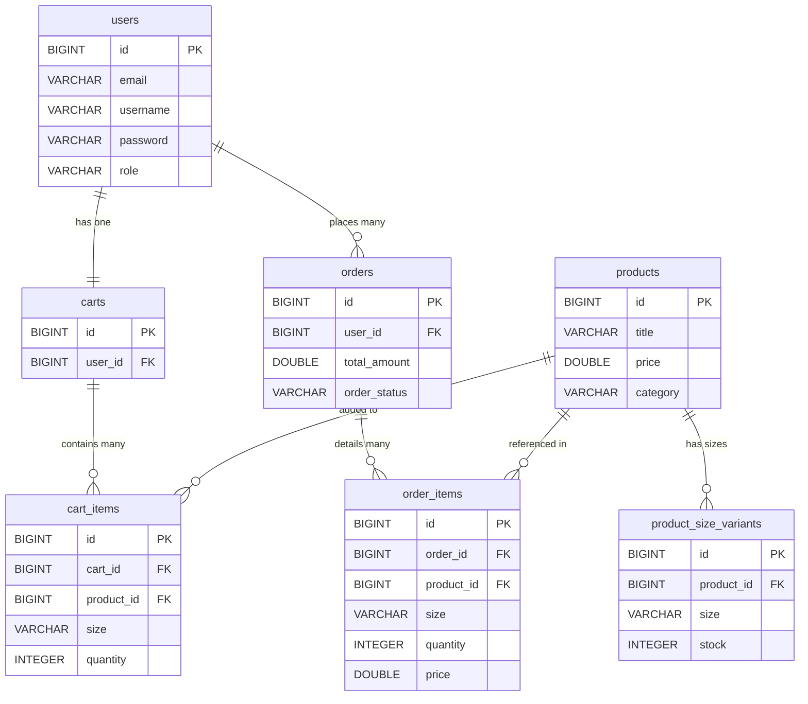

# Database Schema & Entity Guide: Fashionify 🗄️

This document explains the database structure of **Fashionify**. We will look at how different tables are organized, what columns they store, how they relate to one another, and how data travels from your web browser to a database row and back.

---

## 1. Relational Database Concepts for Beginners

Before looking at our tables, let’s explain how databases link information together.

### What is a Table?
A table is like a single spreadsheet sheet. It stores a list of similar things (like a list of `users` or a list of `products`). Every row in the table is a single record, and every column is a property of that record.

### What is a Primary Key (PK)?
A unique ID number given to every single row in a table (like a roll number or national ID card). No two rows can have the same primary key.

### What is a Foreign Key (FK)?
A foreign key is a column in one table that points to the Primary Key of another table. It acts as a connector. For example, if a row in the `orders` table has a column `user_id = 12`, that `12` is a Foreign Key pointing to the user whose ID is 12 in the `users` table.

---

## 2. Types of Relationships (Explained Simply)

There are four ways database tables can connect:

### A. One-to-One (`@OneToOne`)
*   **What is it?** Each row in Table A connects to exactly one row in Table B.
*   **Real Example**: A `User` has exactly one `Cart`.
    - User ID 12 has Cart ID 5. No other user can have Cart ID 5.

### B. One-to-Many (`@OneToMany`) / Many-to-One (`@ManyToOne`)
*   **What is it?** One row in Table A can connect to multiple rows in Table B, but each row in Table B only connects back to that single row in Table A.
*   **Real Example**: One `Product` has many `ProductSizeVariants` (S, M, L, XL).
    - The product "Classic Leather Jacket" (ID 1) has size variants Medium (ID 10, product_id 1) and Large (ID 11, product_id 1). Both variants point to product ID 1.

### C. Many-to-Many (`@ManyToMany`)
*   **What is it?** Multiple rows in Table A can connect to multiple rows in Table B.
*   **Real Example**: `Users` and `Coupons`. A user can redeem many coupons, and a coupon can be redeemed by many users.
    - We use an intermediary table `user_coupon_usages` to track which user used which coupon.

---

## 3. Entity-Relationship (ER) Diagram

Here is how the main database tables connect in Fashionify:



---

## 4. Database Table Breakdown

Let’s review the key tables generated by Hibernate entities in Fashionify:

### Table 1: `users`
*   **Purpose**: Stores credentials, profile summaries, and styling preferences.
*   **Business Role**: Drives authentication and personalization size suggestions.
*   **Key Columns**:
    - `id` (PK): Unique user number.
    - `email`: Log-in email address (unique index).
    - `password`: BCrypt encrypted password.
    - `role`: Access level (`user` or `admin`).
    - Preferred sizes: `top_size`, `bottom_size`, `shoe_size`.

### Table 2: `products`
*   **Purpose**: Stores core catalog product details.
*   **Key Columns**:
    - `id` (PK): Unique product identifier.
    - `title`, `description`, `brand`, `category`.
    - `price`: Base price of the item.
    - `sale_price`: Discounted price (used if active).
*   **Indexes**: Includes database indexes on `price` and `category` to make searches and filters fast.

### Table 3: `product_size_variants`
*   **Purpose**: Stores inventory stock numbers for each size of a product.
*   **Why we need it**: A t-shirt isn't just "in stock". We need to know if we have stock for size "S" vs size "L".
*   **Columns**:
    - `id` (PK)
    - `product_id` (FK): Points back to `products.id`.
    - `size`: S, M, L, XL.
    - `stock`: Current quantity available.

### Table 4: `carts` & `cart_items`
*   **Purpose**: Stores customer shopping carts.
*   **Relationships**:
    - `carts` has a Many-to-One connection pointing to `users`.
    - `cart_items` connects `carts` to `products` (Many-to-One).

### Table 5: `orders` & `order_items`
*   **Purpose**: Tracks customer purchases and shipping details.
*   **Relationships**:
    - `orders` has a Foreign Key `user_id` pointing to `users`.
    - `order_items` records the historical price, quantity, and size of the purchased item.

---

## 5. Trace: How Data Travels Step-by-Step

Let's trace a real project action: **"A customer changes the quantity of an item in their cart"**.

```mermaid
sequenceDiagram
    autonumber
    actor Browser as Frontend React UI
    participant Backend as Spring Boot API
    database DB as MySQL Database

    Browser->>Backend: 1. Click "+" button: POST /api/shop/cart/update-quantity
    activate Backend
    Note over Backend: Read user session from cookies.
    Backend->>DB: 2. SELECT * FROM cart_items WHERE id = 45
    activate DB
    DB-->>Backend: 3. Return CartItem details (current qty = 1)
    deactivate DB
    Note over Backend: Check stock variant in DB.
    Backend->>DB: 4. UPDATE cart_items SET quantity = 2 WHERE id = 45
    activate DB
    DB-->>Backend: 5. Confirm query execution
    deactivate DB
    Backend->>DB: 6. SELECT * FROM cart_items JOIN products ...
    activate DB
    DB-->>Backend: 7. Return entire recalculated cart layout
    deactivate DB
    Backend-->>Browser: 8. Return 200 OK with refreshed cart JSON
    deactivate Backend
    Note over Browser: Redux updates state. UI updates price badge.
```

### Step 1: User Clicks "+" on Cart Drawer (Frontend)
- The user clicks the plus button on their cart panel. The component state captures the new target quantity `2`.
- Redux dispatches `updateCartQuantity` which initiates an HTTP request.
- **Data sent**: `POST /api/shop/cart/update` with body `{ productId: 1, size: "M", quantity: 2 }`.

### Step 2: Request arrives at Server (Backend)
- The request passes through `AuthTokenFilter`, checking the user's cookies.
- It enters `ShopCartController.updateCartItemQuantity()`.
- The controller forwards the request parameters to `ShopCartService`.

### Step 3: Server talks to Database (SQL Operations)
- The service loads the user's active cart.
  - SQL executed: `SELECT * FROM carts WHERE user_id = 12;`
- The service checks if the requested variant has enough stock:
  - SQL executed: `SELECT stock FROM product_size_variants WHERE product_id = 1 AND size = 'M';`
- If stock is sufficient (e.g. stock is 10, user wants 2), it updates the quantity column:
  - SQL executed: `UPDATE cart_items SET quantity = 2 WHERE cart_id = 5 AND product_id = 1 AND size = 'M';`

### Step 4: Database returns confirmation
- MySQL updates the row and returns a success confirmation.
- The repository receives this and returns the updated entity to the service.

### Step 5: Server sends response to Frontend
- The controller converts the cart entity into a clean `CartDto` containing all items, titles, image URLs, and computed prices.
- It sends this back across the network as a JSON response.

### Step 6: Frontend re-renders screen
- The Axios client receives the JSON data.
- Redux Toolkit updates the state of `shopCartSlice` with the new data.
- React detects the Redux store change and automatically re-renders the cart drawer. The subtotal changes on screen instantly.

---

### 🔗 Next Steps & Documentation
* 🛍️ **[Project Overview](file:///Users/subhajit/Developer/Development/fashionify/docs/PROJECT_OVERVIEW.md)**: Conceptual guide to the store's goals, user roles, and features.
* 🏗️ **[System Architecture Guide](file:///Users/subhajit/Developer/Development/fashionify/docs/ARCHITECTURE_GUIDE.md)**: Explore how frontend-backend requests and database queries flow step-by-step.
* ⚙️ **[Feature Flows Guide](file:///Users/subhajit/Developer/Development/fashionify/docs/FEATURE_FLOWS.md)**: Learn how user clicks process into database updates.
* 🔌 **[REST API Reference Guide](file:///Users/subhajit/Developer/Development/fashionify/docs/API_GUIDE.md)**: Explore routes, request formats, and permissions.
* 🎓 **[Beginner Onboarding Guide](file:///Users/subhajit/Developer/Development/fashionify/docs/BEGINNER_GUIDE.md)**: Learn the core concepts of the project from scratch.
* 🤝 **[Contributing Guide](file:///Users/subhajit/Developer/Development/fashionify/docs/CONTRIBUTING_GUIDE.md)**: Guidelines for styling, naming conventions, and contributing.
* 🔒 **[Publication Safety Audit](file:///Users/subhajit/Developer/Development/fashionify/docs/PUBLICATION_SAFETY_AUDIT.md)**: Verification of security patterns.
