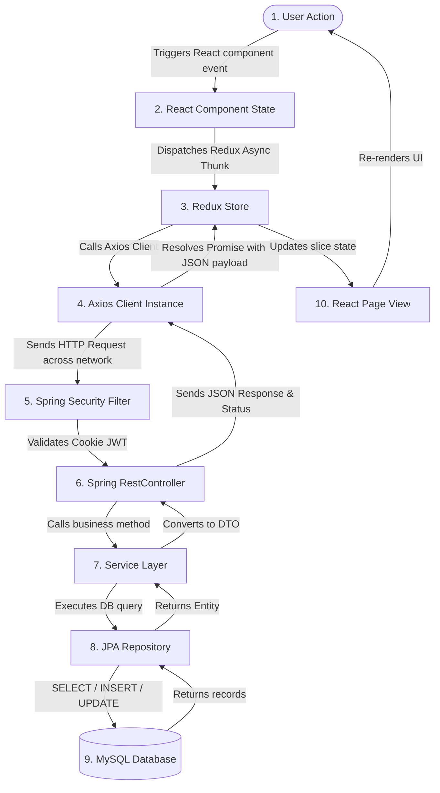

# Feature Flows Guide: Fashionify ⚙️

This document traces how data moves through **Fashionify** for every key user action. We will follow the journey from the moment a user clicks a button on their screen, through the network APIs, into the Spring Boot backend layer, down to the database, and back up to update the user interface.

---

## 1. Summary of standard Request Flow

Every feature in Fashionify follows this high-level, step-by-step sequence:

---

## 2. Feature Flows: Step-by-Step

---

### Flow A: User Registration (OTP Signup)
*   **User Goal**: Create a new customer account securely by verifying their email.
*   **Step-by-Step Flow**:
    1.  **Frontend Action**: The user fills out the Signup Form (Email, Username, Password, DOB, Gender) and clicks the "Register" button.
    2.  **API Request**:
        - Step A1: Redux dispatches `registerUser` initiating a `POST` request to `/api/auth/signup/initiate` with the sign-up details in the JSON body.
    3.  **Controller Logic**: `OtpAuthController.initiateSignup()` receives the payload, verifies that the required fields are filled, and formats inputs.
    4.  **Service Logic**: `OtpService.initiateSignup()` checks if the email or username is already taken. If free, it generates a random 4-digit code (OTP), saves it to the database with a 5-minute expiry, and triggers `EmailService` to dispatch a verification email using the **Brevo API**.
    5.  **Repository Logic**: Queries `userRepository.existsByEmail()` and saves the temporary OTP using `otpVerificationRepository.save()`.
    6.  **Database Operations**: `INSERT INTO otp_verifications (email, otp, expires_at, ...)`
    7.  **Response**: Returns HTTP `200 OK` with `success: true` and a message stating that the OTP was sent.
    8.  **UI Update (OTP Prompt)**: The frontend displays an OTP modal input box.
    9.  **Verification Action**: The user checks their email, enters the 4-digit code in the browser, and clicks "Verify".
    10. **API Request (Verify)**: Sends a `POST` request to `/api/auth/signup/verify` with the email and entered OTP code.
    11. **Controller & Service Logic (Verify)**: `OtpAuthController.verifyOtp()` reads the input. `OtpService.verifyOtpAndRegister()` fetches the saved verification record, checks if it is expired, and compares the values.
    12. **Database Operations (Save User)**: If the OTP is correct, it encrypts the user's password using BCrypt and writes the new user row to the database.
        - `INSERT INTO users (email, username, password, role, ...)`
        - `DELETE FROM otp_verifications WHERE email = ...`
    13. **Response & UI Update**: Backend responds with `201 Created`. The frontend updates the Redux registration state and redirects the user to the Login page with a success Toast notification.

---

### Flow B: User Login
*   **User Goal**: Log into their existing customer account.
*   **Step-by-Step Flow**:
    1.  **Frontend Action**: User inputs their email and password on the Login page and clicks "Sign In".
    2.  **API Request**: Redux dispatches `loginUser` which makes a `POST` request to `/api/api/auth/login` containing the credentials.
    3.  **Controller Logic**: `AuthController.authenticateUser()` accepts the payload.
    4.  **Security Integration**: Passes credentials to `authenticationManager.authenticate()`. Spring Security loads user details via `UserDetailsServiceImpl` and verifies the hashed passwords.
    5.  **Token Generation**: Upon successful verification, `JwtUtils` generates a cryptographically signed JSON Web Token (JWT) containing the user's ID, username, and role.
    6.  **Cookie Attachment**: The backend writes this token as an **HTTP-Only, Secure Cookie** directly onto the HTTP response header.
    7.  **Response**: Returns `200 OK` containing sanitized user details (username, email, custom sizes, styles).
    8.  **UI Update**: Redux updates `authSlice.isAuthenticated = true` and `authSlice.user` variables. The frontend router redirects the customer to `/shop/home` and displays a login welcome message.

---

### Flow C: Session Authentication Check
*   **User Goal**: Stay logged in automatically when refreshing the browser window or reopening the website.
*   **Step-by-Step Flow**:
    1.  **Frontend Action**: The web page loads for the first time.
    2.  **API Request**: React's root layout triggers a React `useEffect` hook that sends a `GET` request to `/api/auth/check-auth`.
    3.  **Security Filter (Decoupling Interceptor)**: `AuthTokenFilter` intercepts the request before it reaches any Controller. It extracts the JWT from the HTTP-Only cookie, validates the cryptographic signature, and extracts the user's email.
    4.  **Controller Logic**: `AuthController.checkAuth()` runs. It gets the current security context and returns the logged-in user's profile details.
    5.  **Repository Logic**: Queries `userRepository` using the ID inside the authenticated token to load profile preferences.
    6.  **Response**:
        - If the cookie contains a valid, active JWT: Returns `200 OK` with user credentials.
        - If the cookie is missing or invalid: Returns `401 Unauthorized`.
    7.  **UI Update**:
        - On success: Redux sets `isAuthenticated = true` and displays the user's customized interface.
        - On failure: Redux clears credentials, sets `isAuthenticated = false`, and allows the user to browse as a guest.

---

### Flow D: Product Listing (Catalog Browse)
*   **User Goal**: Browse clothing products on the store catalog.
*   **Step-by-Step Flow**:
    1.  **Frontend Action**: The user opens the Shop page.
    2.  **API Request**: Redux dispatches `fetchAllShopProducts` sending a `GET` request to `/api/shop/products/get`.
    3.  **Controller Logic**: `ShopProductController.getAllProducts()` receives request parameters for category, brand, and sorting preferences.
    4.  **In-Memory Caching (JVM Performance)**: The controller calls the service, which is decorated with `@Cacheable(value = "shopProducts")`. If someone has requested this catalog view recently, the service returns the data instantly from memory (JVM cache) without touching the database!
    5.  **Repository & Database Queries**: If the cache has expired or does not exist, the repository executes a `SELECT` statement on the `products` table applying filters and sorting indexes.
    6.  **Response**: Returns `200 OK` containing a list of products.
    7.  **UI Update**: Redux updates `shopProducts.productList`. The frontend displays the products in a Neubrutalist Grid layout.

---

### Flow E: Search
*   **User Goal**: Find a product by typing a search keyword.
*   **Step-by-Step Flow**:
    1.  **Frontend Action**: The user types a word (e.g. "jacket") in the search bar.
    2.  **Debouncing Protection**: The frontend waits 500ms after the user stops typing (debouncing) to avoid hitting the server on every keystroke.
    3.  **API Request**: Dispatches `getSearchResults` making a `GET` request to `/api/shop/search/{keyword}`.
    4.  **Controller & Service Logic**: `ShopSearchController.searchProducts()` receives the keyword and converts it into a search pattern.
    5.  **Repository Logic**: Executes `productRepository.findByTitleContainingIgnoreCaseOrBrandContainingIgnoreCase()`.
    6.  **Database Operations**: Run SQL: `SELECT * FROM products WHERE title LIKE '%jacket%' OR brand LIKE '%jacket%'`.
    7.  **Response**: Returns `200 OK` containing matching products.
    8.  **UI Update**: Updates the search slice. The results are loaded on the screen instantly.

---

### Flow F: Shopping Cart Management
*   **User Goal**: Add an item to the cart, or change its quantity.
*   **Step-by-Step Flow**:
    1.  **Frontend Action**: User selects a product size (e.g., Medium) and clicks "Add to Cart".
    2.  **API Request**: Sends a `POST` request to `/api/shop/cart/add` containing `{ productId, size, quantity }`.
    3.  **Controller & Service Logic**: `ShopCartController.addToCart()` checks the user's authentication context. `ShopCartService` checks if the customer already has an active cart in the DB.
        - It validates if the requested product variant (e.g., Medium size) is in stock.
    4.  **Database Operations**:
        - If the item isn't in the cart: `INSERT INTO cart_items (cart_id, product_id, size, quantity)`.
        - If the item is already in the cart: `UPDATE cart_items SET quantity = quantity + 1`.
    5.  **Response**: Returns `200 OK` with the updated cart structure.
    6.  **UI Update**: Redux updates the cart state. The side-drawer cart slide-out opens, showing the updated list and computed total prices.

---

### Flow G: Checkout & Payment
*   **User Goal**: Place an order and pay for the items.
*   **Step-by-Step Flow**:
    1.  **Frontend Action**: The user chooses a shipping address and clicks "Pay Now".
    2.  **API Request**: Redux dispatches `createNewOrder` sending a `POST` request to `/api/shop/order/create` with address details and cart item summary.
    3.  **Controller & Service Logic**: `ShopOrderController.createOrder()` runs. `ShopOrderService` locks the inventory variants to prevent double selling, computes taxes/totals, and verifies coupon validity.
    4.  **Payment Gateway Integration**:
        - If payment mode is "Simulated": It automatically sets order status to `Paid`.
        - If payment mode is "Razorpay": It makes a call to Razorpay APIs to generate a payment ID.
    5.  **Database Operations**:
        - Saves the order details: `INSERT INTO orders (...)`.
        - Deducts stock: `UPDATE product_variants SET stock = stock - quantity WHERE ...`.
        - Clears the user's cart: `DELETE FROM cart_items WHERE cart_id = ...`.
    6.  **Response**: Returns `201 Created` with order ID and invoice data.
    7.  **UI Update**: The frontend redirects the user to the Order Success Page, clears the active cart drawer, and lets the user click "Download Invoice PDF".

---

### Flow H: Administrator Product CRUD
*   **User Goal**: Add a new product to the catalog as an admin.
*   **Step-by-Step Flow**:
    1.  **Frontend Action**: Admin fills out the Add Product form, uploads an image, and clicks "Add Product".
    2.  **Image Upload (Cloud Storage)**: The image is uploaded first. The client sends the image file to the backend, which forwards it to **Cloudinary**. Cloudinary saves the file and returns a permanent web URL.
    3.  **API Request**: Admin dashboard sends a `POST` request to `/api/admin/products/add` containing the image URL, title, description, category, and size stock allocations.
    4.  **Controller Security Check**: `AdminProductController.addProduct()` checks if the authenticated user has the role `ROLE_ADMIN`. If not, it returns `403 Forbidden`.
    5.  **Service & Database Logic**: `AdminProductService` creates a new `Product` entity and saves it.
        - `INSERT INTO products (title, description, price, image_url, ...)`
        - For each size variant: `INSERT INTO product_size_variants (product_id, size, stock)`.
    6.  **Cache Invalidation**: The service executes `@CacheEvict(value = "shopProducts", allEntries = true)` to delete old cached catalog listings, ensuring customers see the new product instantly on next page load.
    7.  **Response & UI Update**: Returns `201 Created`. The admin list updates, and the product dashboard updates.

---

### Flow I: Admin Analytics Dashboard
*   **User Goal**: Check overall sales metrics.
*   **Step-by-Step Flow**:
    1.  **Frontend Action**: Admin opens the Analytics page.
    2.  **API Request**: Sends a `GET` request to `/api/admin/analytics/summary`.
    3.  **Controller & Service Logic**: `AdminAnalyticsController.getSummary()` runs.
    4.  **Database Operations**:
        - Run: `SELECT SUM(total_amount) FROM orders WHERE status = 'Delivered'`
        - Run: `SELECT COUNT(*) FROM orders`
        - Run: `SELECT AVG(total_amount) FROM orders`
    5.  **Response**: Returns `200 OK` with JSON containing total revenue, order count, and monthly sales data.
    6.  **UI Update**: React loads the data into interactive dashboard charts.

---

### 🔗 Next Steps & Documentation
* 🛍️ **[Project Overview](file:///Users/subhajit/Developer/Development/fashionify/docs/PROJECT_OVERVIEW.md)**: Conceptual guide to the store's goals, user roles, and features.
* 🏗️ **[System Architecture Guide](file:///Users/subhajit/Developer/Development/fashionify/docs/ARCHITECTURE_GUIDE.md)**: Explore how frontend-backend requests and database queries flow step-by-step.
* 🔌 **[REST API Reference Guide](file:///Users/subhajit/Developer/Development/fashionify/docs/API_GUIDE.md)**: Explore routes, request formats, and permissions.
* 🗄️ **[Database Entity Guide](file:///Users/subhajit/Developer/Development/fashionify/docs/DATABASE_GUIDE.md)**: Study tables, relationships, and queries.
* 🎓 **[Beginner Onboarding Guide](file:///Users/subhajit/Developer/Development/fashionify/docs/BEGINNER_GUIDE.md)**: Learn the core concepts of the project from scratch.
* 🤝 **[Contributing Guide](file:///Users/subhajit/Developer/Development/fashionify/docs/CONTRIBUTING_GUIDE.md)**: Guidelines for styling, naming conventions, and contributing.
* 🔒 **[Publication Safety Audit](file:///Users/subhajit/Developer/Development/fashionify/docs/PUBLICATION_SAFETY_AUDIT.md)**: Verification of security patterns.
