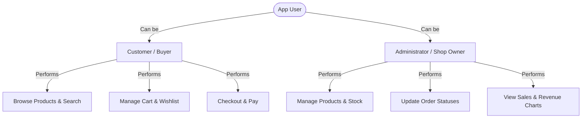

# Project Overview: Fashionify 🛍️

Welcome to **Fashionify**! This document is designed to give you a complete, high-level understanding of what this project is, why it was built, how it works under the hood, and what you can learn from it.

Whether you are a student, a beginner developer, or looking to contribute to open-source, this guide is written for you in plain, jargon-free English.

---

## 1. What is Fashionify?

**Fashionify** is a modern, full-stack e-commerce web application. Imagine it as a fully functional online clothing store where customers can browse items, add them to a shopping cart, and make purchases, while store administrators can manage the items for sale, view sales charts, and handle customer orders.

What makes Fashionify unique is its visual style: it uses a **Neubrutalism design style**. This means instead of soft shadows and round corners, the website uses bold colors, thick black borders, and hard shadows to look modern, tactile, and stylish.

---

## 2. Why Does it Exist?

In the real world, building a production-ready application requires connecting many different parts:
1. A **User Interface (Frontend)** that is fast and looks great.
2. A **Server (Backend)** that securely handles login, payments, and data processing.
3. A **Database** that remembers user accounts, product stock, and order details.
4. **Third-Party Services** to handle complex tasks like processing credit card payments, sending automated verification emails, and hosting images.

Fashionify was built as an educational blueprint to show how all of these pieces fit together using industry-standard patterns. It shows you how to build a clean, secure, and fast application without taking shortcuts.

---

## 3. User Roles

Fashionify has two main types of users, each having a different experience and set of permissions:



### A. The Customer (Buyer)
- **Goal**: Find and buy clothing items.
- **Key Actions**:
  - Sign up and verify their email with a 4-digit code (OTP).
  - Search for products and filter them by category or price.
  - Add items of specific sizes (S, M, L, XL) to their shopping cart or wishlist.
  - Provide shipping addresses.
  - Complete checkouts and download invoice receipts.

### B. The Administrator (Shop Owner)
- **Goal**: Keep the store running smoothly and track business success.
- **Key Actions**:
  - Add, edit, or delete products and manage their stock level.
  - View analytics charts (revenue, number of sales, average order value).
  - Manage home screen promo banners (carousel slides).
  - Update order delivery status (e.g., Pending, Shipped, Delivered).

---

## 4. High-Level Architecture

Fashionify uses a **Client-Server Model**. This means the application is split into two independent programs that talk to each other over the network:

1. **The Client (Frontend)**: The website running inside the user's web browser. It is built with **React** and styled using **Tailwind CSS**.
2. **The Server (Backend)**: The logic engine running on a computer or cloud server. It is built with **Spring Boot** (Java) and handles security, database queries, and payments.

Here is how the data flows:

```mermaid
sequenceDiagram
    autonumber
    actor User as User Browser (Frontend)
    participant Server as Spring Boot API (Backend)
    database DB as MySQL Database
    participant ThirdParty as External APIs (Cloudinary, Brevo, Razorpay)

    User->>Server: 1. Send Request (e.g., Get Product List)
    activate Server
    Server->>DB: 2. Query Data (e.g., SELECT * FROM products)
    activate DB
    DB-->>Server: 3. Return Raw Data
    deactivate DB
    Server-->>User: 4. Respond with Data (JSON format)
    deactivate Server

    Note over User, ThirdParty: When performing actions like uploading a product image or checking out:
    User->>Server: 5. Upload Image or Pay
    activate Server
    Server->>ThirdParty: 6. Forward Request (e.g., Save image in cloud / Process payment)
    activate ThirdParty
    ThirdParty-->>Server: 7. Confirm success
    deactivate ThirdParty
    Server->>DB: 8. Update DB (e.g., Save image URL / Save Order)
    Server-->>User: 9. Respond Success to Browser
    deactivate Server
```

---

## 5. Technology Stack Overview

Here is a summary of the technology tools used in the project, explained simply:

| Technology | What is it? | Why do we need it? | How is it used here? |
| :--- | :--- | :--- | :--- |
| **React** | A Javascript library for building user interfaces. | To make the website interactive, responsive, and update parts of the screen without reloading the whole page. | Renders pages, captures clicks, displays forms, and updates the shopping cart in real-time. |
| **Spring Boot** | A Java framework for building backend applications. | To create a secure, fast, and organized API that handles business logic and talks to the database. | Handles security controls, checks user logins, computes prices, and queries the database. |
| **MySQL** | A relational database management system. | To store structured, permanent data that must not be lost (like user accounts, products, and order history). | Stores all user, product, cart, and order records in organized tables. |
| **Redux Toolkit** | A centralized state management tool. | To store shared application data in one single place so different parts of the website can access it easily. | Keeps track of whether a user is logged in, what is currently inside their cart, and their profile information. |
| **Tailwind CSS** | A utility-first CSS framework. | To write styles directly inside our HTML elements, making design changes faster and cleaner. | Powers the custom Neubrutalism design system (borders, shadows, grid spacing). |
| **Spring Security & JWT** | Security tools for Java. | To lock down endpoints so only logged-in users or admins can access private data. | Generates secure digital keycards (JSON Web Tokens) when a user logs in, storing them in secure browser cookies. |
| **Cloudinary** | A cloud service for managing images. | To store product pictures on a specialized image server rather than bloating our database. | When an admin uploads a product image, it goes directly to Cloudinary, and we save only the URL in MySQL. |
| **Brevo** | An email notification API. | To send emails to users programmatically. | Sends the 4-digit verification code (OTP) when users register their account. |
| **Razorpay** | A online payment gateway. | To accept debit/credit cards or online wallets from customers securely. | Generates checkout orders and confirms payment success (running in "Simulated" mode for safe testing). |

---

## 6. Project Architecture Subsystems

To keep our codebase clean and organized, we split both the backend and frontend into distinct folders based on responsibility.

### A. Backend Architecture (Spring Boot)
The backend is structured using a **layered pattern**:
* **Controller Layer**: The receptionist. It receives incoming network requests from the frontend, checks if they are valid, and routes them to the correct service.
* **Service Layer**: The brain. It contains the business rules (e.g., "calculate discount coupons," "check if product is in stock").
* **Repository Layer**: The librarian. It writes and executes database queries to read or write data.
* **Entity Layer**: The blueprints. These classes define what our database tables look like (e.g., columns, data types).

### B. Frontend Architecture (React)
The frontend is split into reusable blocks:
* **Pages**: Entire screens (e.g., Home Page, Admin Dashboard Page, Cart Page).
* **Components**: Small UI blocks reused across screens (e.g., custom Buttons, Input fields, Product Cards).
* **Store (Redux)**: Global variables shared between pages (e.g., `authSlice` to check if you are logged in).
* **Services**: Setup files that talk to the backend using a tool named **Axios**.

---

## 7. Key Learning Opportunities

By exploring this codebase, you will learn how to:
1. **Manage App-wide State**: Understand how Redux stores data globally and makes it available to any component.
2. **Implement Solid Security**: See how stateless JWTs are created, sent to the browser via secure cookies, and verified on every server request.
3. **Connect External Services**: Learn how to write code to upload files to Cloudinary, send emails via Brevo, and process test transactions with Razorpay.
4. **Optimize Database Queries**: Study how database indexes and memory caching (`@Cacheable`) speed up loading times from seconds to milliseconds.
5. **Write Clean, Decoupled Code**: Learn why we use DTOs (Data Transfer Objects) instead of sending raw database tables directly to the frontend.

Now that you have a high-level view of Fashionify, check out the detailed guides in the `docs/` folder!

---

### 🔗 Next Steps & Documentation
* 🏗️ **[System Architecture Guide](file:///Users/subhajit/Developer/Development/fashionify/docs/ARCHITECTURE_GUIDE.md)**: Explore how frontend-backend requests and database queries flow step-by-step.
* ⚙️ **[Feature Flows Guide](file:///Users/subhajit/Developer/Development/fashionify/docs/FEATURE_FLOWS.md)**: Learn how user clicks process into database updates.
* 🔌 **[REST API Reference Guide](file:///Users/subhajit/Developer/Development/fashionify/docs/API_GUIDE.md)**: Explore routes, request formats, and permissions.
* 🗄️ **[Database Entity Guide](file:///Users/subhajit/Developer/Development/fashionify/docs/DATABASE_GUIDE.md)**: Study tables, relationships, and queries.
* 🎓 **[Beginner Onboarding Guide](file:///Users/subhajit/Developer/Development/fashionify/docs/BEGINNER_GUIDE.md)**: Learn the core concepts of the project from scratch.
* 🤝 **[Contributing Guide](file:///Users/subhajit/Developer/Development/fashionify/docs/CONTRIBUTING_GUIDE.md)**: Guidelines for styling, naming conventions, and contributing.
* 🔒 **[Publication Safety Audit](file:///Users/subhajit/Developer/Development/fashionify/docs/PUBLICATION_SAFETY_AUDIT.md)**: Verification of security patterns.
